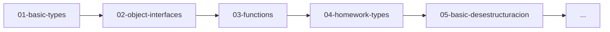

<div align="center">


<p><strong>Aprende TypeScript desde cero con ejemplos prácticos y ejercicios interactivos</strong></p>

<p>
<a href="#-instalación-rápida">🎯 Comenzar</a> • 
<a href="#-roadmap-de-aprendizaje">📚 Contenido</a> • 
<a href="#-configuración-del-entorno">🔧 Configuración</a>
</p>

</div>


---

## 🎯 ¿Qué es este repositorio?

Este es un **entorno de aprendizaje modular** diseñado para desarrolladores que ya conocen JavaScript y quieren dominar TypeScript de forma práctica y estructurada [1](#0-0) .

### ✨ Características principales

- 🎮 **Sistema de temas intercambiables** - Activa un concepto a la vez para aprendizaje enfocado
- 📝 **11 módulos progresivos** - Desde tipos básicos hasta decoradores avanzados  
- 🔄 **Ejemplos interactivos** - Cada tema incluye código ejecutable
- ⚡ **Configuración moderna** - Vite + TypeScript para desarrollo rápido

---

## 🚀 Instalación Rápida

```bash
# 1. Clona el repositorio
git clone https://github.com/Adrian-DT/01-typescript-intro.git
cd 01-typescript-intro

# 2. Instala dependencias
npm install

# 3. Inicia el servidor de desarrollo
npm run dev
```

¡Listo! Abre tu navegador en `http://localhost:5173` y comienza a aprender.

---

## 📚 Roadmap de Aprendizaje

El repositorio está organizado en **11 temas progresivos** que puedes activar individualmente [2](#0-1) :

### 🏗️ Fundamentos
| Tema | Descripción | Estado |
|------|-------------|--------|
| `01-basic-types` | Tipos primitivos y anotaciones | 💤 |
| `02-object-interfaces` | Objetos, arreglos e interfaces | 💤 |
| `03-functions` | Funciones básicas y tipado | 💤 |

### 🔧 Nivel Intermedio  
| Tema | Descripción | Estado |
|------|-------------|--------|
| `04-homework-types` | Práctica con interfaces | 💤 |
| `05-basic-desestructuracion` | Desestructuración de objetos/arrays | 💤 |
| `06-functions-destructuracion` | Desestructuración en parámetros | 💤 |
| `07-import-export-modulos` | Sistema de módulos ES6 | 💤 |

### 🚀 Nivel Avanzado
| Tema | Descripción | Estado |
|------|-------------|--------|
| `08-clases` | POO y composición sobre herencia | 💤 |
| `09-genericos` | Tipos genéricos | 💤 |
| `10-decoradores` | Metadatos y decoradores | 💤 |
| `11-encadenamiento-opcional` | Optional chaining | ✅ **Activo** |

---

## 🎮 Cómo Usar el Sistema de Temas

El repositorio usa un **sistema de activación modular** donde solo un tema está activo a la vez para aprendizaje enfocado [3](#0-2) :

### Cambiar de Tema

1. Abre `src/main.ts`
2. Comenta el tema actual:
   ```typescript
   // import './topics/11-encadenamiento-opcional';
   ```
3. Descomenta el tema que quieres estudiar:
   ```typescript
   import './topics/01-basic-types';
   ```
4. Guarda y el servidor se recargará automáticamente

### Ejemplo de Progresión



---

## 🔧 Configuración del Entorno

### Requisitos Previos
- **Node.js** v18+ 
- **npm/yarn/pnpm** 
- **VS Code** (recomendado)

### Extensiones Recomendadas para VS Code
```json
{
  "recommendations": [
    "ms-vscode.vscode-typescript-next",
    "bradlc.vscode-tailwindcss",
    "esbenp.prettier-vscode"
  ]
}
```

### Scripts Disponibles
```bash
npm run dev      # Servidor de desarrollo
npm run build    # Build de producción  
npm run preview  # Preview del build
```

---

## 🎯 Objetivos de Aprendizaje

Al completar este curso serás capaz de:

- ✅ **Dominar el sistema de tipos** de TypeScript
- ✅ **Crear interfaces robustas** para contratos de datos
- ✅ **Implementar clases** siguiendo buenas prácticas
- ✅ **Usar genéricos** para código reutilizable
- ✅ **Aplicar decoradores** para metaprogramación
- ✅ **Estructurar proyectos** con módulos ES6

---

## 🤝 Contribuir

¿Encontraste un error o tienes una mejora? ¡Las contribuciones son bienvenidas!

1. Fork el proyecto
2. Crea una rama para tu feature (`git checkout -b feature/AmazingFeature`)
3. Commit tus cambios (`git commit -m 'Add some AmazingFeature'`)
4. Push a la rama (`git push origin feature/AmazingFeature`)
5. Abre un Pull Request

---

## 📄 Licencia

Este proyecto está bajo la Licencia MIT [4](#0-3) . Consulta el archivo `LICENSE` para más detalles.

---

<div align="center">

**¿Te gustó este proyecto? ¡Dale una ⭐ en GitHub!**

[🐛 Reportar Bug](../../issues) • [💡 Solicitar Feature](../../issues) • [📖 Documentación](../../wiki)

</div>
```